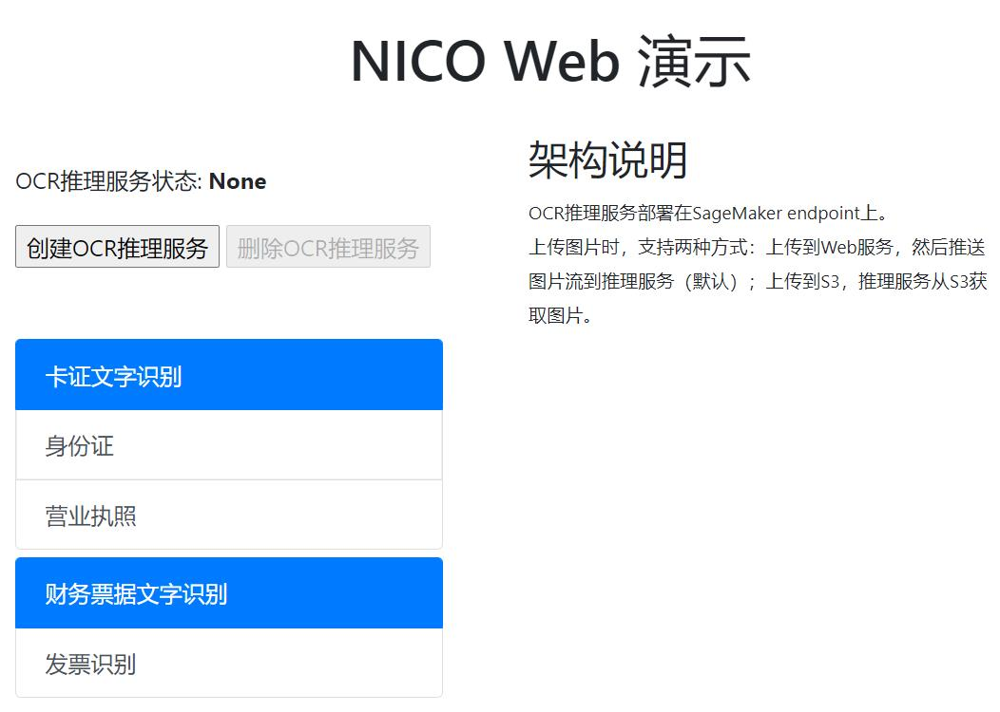

# Customized-OCR

## 免责说明
建议测试过程中使用此方案，生产环境使用请自行考虑评估。
当您对方案需要进一步的沟通和反馈后，可以联系 nwcd_labs@nwcdcloud.cn 获得更进一步的支持。
欢迎联系参与方案共建和提交方案需求, 也欢迎在 github 项目issue中留言反馈bugs。


## 项目说明
本项目基于[PaddleOCR](https://github.com/PaddlePaddle/PaddleOCR)，实现在SageMaker上的部署推理，提供文本识别功能。  
返回格式为[AWS Textract](https://docs.aws.amazon.com/textract/latest/dg/what-is.html)。

## 识别效果展示


## 使用方法
可以使用Web方式或JupyterLab方式进行推理。
### 使用Web方式推理
#### 准备JDK/JRE 8
Web方式使用SpringBoot方式启动，需要使用JDK/JRE 8，官方下载地址：[https://www.oracle.com/java/technologies/javase/javase-jdk8-downloads.html](https://www.oracle.com/java/technologies/javase/javase-jdk8-downloads.html)  
#### 设置AWS访问密钥或角色、默认区域
由于Web服务需要访问SageMaker推理功能，包括创建模型、创建终端节点配置和创建终端节点，以及调用终端节点进行推理。因此需要设置一个具有这些权限的账号。  
- Web服务器端在本地运行，请使用AWS CLI设置访问密钥、默认区域。
- Web服务器端在EC2上运行，推荐使用角色方式，也可以采用访问密钥方式。
#### 下载Web运行包
下载地址：https://nwcd-samples.s3.cn-northwest-1.amazonaws.com.cn/nico/v0.1.0/ocr-0.1.0.jar  
存放本地时，建议存放到英文目录下，不含空格。
#### 运行Web服务器端
命令：`java -jar ocr-0.1.0.jar`  
启动成功会输出以下类似内容：
```
[2020-12-12 10:55:33.954][DEBUG] c.n.samples.ocr.OcrApplication - Running with Spring Boot v2.4.0, Spring v5.3.1
[2020-12-12 10:55:33.954][INFO] c.n.samples.ocr.OcrApplication - No active profile set, falling back to default profiles: default
[2020-12-12 10:55:36.524][INFO] c.n.samples.ocr.OcrApplication - Started OcrApplication in 3.14 seconds (JVM running for 4.373)
```
#### 访问Web服务器
在浏览器中输入服务器地址：`http://127.0.0.1`，出现以下界面。

点击 **创建OCR推理服务** 按钮，预计7分钟左右，OCR推理服务器状态变为：InService，这时即可进行推理。
#### 清理环境
点击 **删除OCR推理服务** 按钮，删除SageMaker推理服务。  
### 使用JupyterLab方式推理
参见[2-inference/inference.ipynb](2-inference/inference.ipynb)
