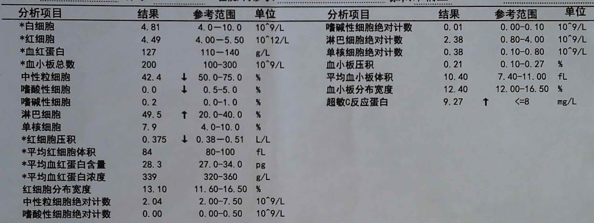
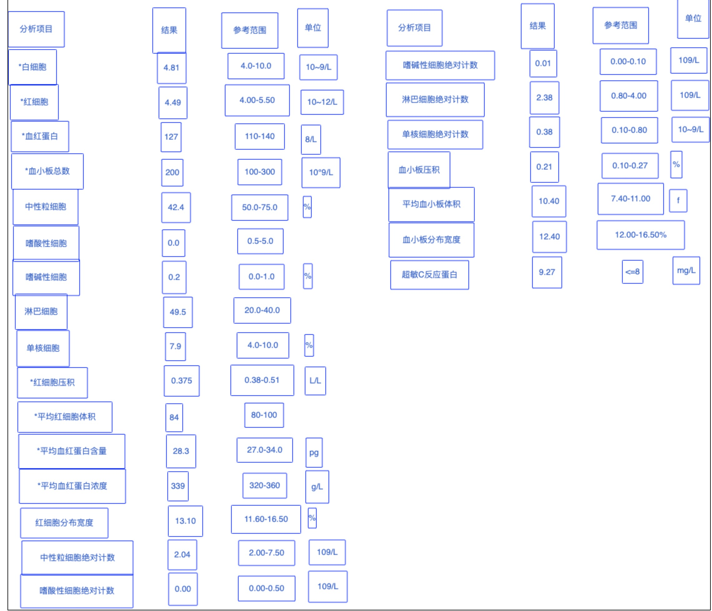

# Customized-OCR

## 免责说明
建议测试过程中使用此方案，生产环境使用请自行考虑评估。
当您对方案需要进一步的沟通和反馈后，可以联系 nwcd_labs@nwcdcloud.cn 获得更进一步的支持。
欢迎联系参与方案共建和提交方案需求, 也欢迎在 github 项目issue中留言反馈bugs。

## 项目说明
本项目基于[PaddleOCR](https://github.com/PaddlePaddle/PaddleOCR)，实现在SageMaker上的部署推理，提供文本识别功能。  
返回格式为[AWS Textract](https://docs.aws.amazon.com/textract/latest/dg/what-is.html)。

## 效果展示

## 使用方法
[点击查看推理使用方法](2-inference/inference.ipynb)