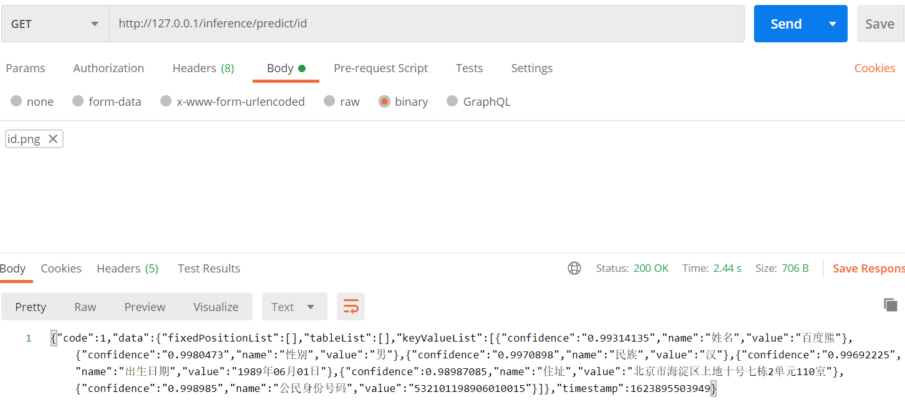

# Customized-OCR

## 免责说明
建议测试过程中使用此方案，生产环境使用请自行考虑评估。
当您对方案需要进一步的沟通和反馈后，可以联系 nwcd_labs@nwcdcloud.cn 获得更进一步的支持。
欢迎联系参与方案共建和提交方案需求, 也欢迎在 github 项目issue中留言反馈bugs。

## 项目说明
本项目在SageMaker上部署推理，提供文本识别功能。  
返回格式为[AWS Textract](https://docs.aws.amazon.com/textract/latest/dg/what-is.html)。

## 识别效果展示


## 使用方法
可以使用Web方式或JupyterLab方式进行推理。
### 使用Web方式推理
#### 架构说明
OCR推理服务部署在SageMaker endpoint上。
上传图片时，支持两种方式：
- 上传到Web服务，Web服务发送图片流到推理服务，不留存图片（默认）。
- 上传到S3，推理服务从S3获取图片，S3留存图片。

#### 准备JDK/JRE 8
Web方式使用SpringBoot方式启动，需要使用JDK/JRE 8，官方下载地址：[https://www.oracle.com/java/technologies/javase/javase-jdk8-downloads.html](https://www.oracle.com/java/technologies/javase/javase-jdk8-downloads.html)  
#### 设置AWS访问密钥或角色、默认区域
由于Web服务需要访问SageMaker推理功能，包括创建模型、创建终端节点配置和创建终端节点，以及调用终端节点进行推理。因此需要设置一个具有这些权限的账号。  
- Web服务在本地服务器运行，请使用AWS CLI设置访问密钥、默认区域。
- Web服务在EC2上运行，推荐使用角色方式，也可以采用访问密钥方式，需设置默认区域。
#### 下载Web运行包
下载地址：https://nwcd-samples.s3.cn-northwest-1.amazonaws.com.cn/nico/latest/ocr.jar  
存放本地时，建议存放到英文目录下，不含空格。
#### 运行Web服务
命令：`java -jar ocr.jar`  
如果需要把上传的文件存放到S3，请使用命令：`java -jar ocr.jar --uploadType=s3 --bucketName=<BucketName>`  
更多启动参数参见[boot.md](boot.md)  
注意：文件上传到S3时，需要设置该存储桶的跨源资源共享(CORS)，参见常见问题的[如何设置S3存储桶跨源资源共享(CORS)](#如何设置S3存储桶跨源资源共享cors)  
启动成功会输出以下类似内容：
```
[2020-12-12 10:55:33.954][DEBUG] c.n.samples.ocr.OcrApplication - Running with Spring Boot v2.4.0, Spring v5.3.1
[2020-12-12 10:55:33.954][INFO] c.n.samples.ocr.OcrApplication - No active profile set, falling back to default profiles: default
[2020-12-12 10:55:36.524][INFO] c.n.samples.ocr.OcrApplication - Started OcrApplication in 3.14 seconds (JVM running for 4.373)
```
#### 访问Web服务
在浏览器中输入服务器地址：http://127.0.0.1/，出现以下界面。

点击 **创建OCR推理服务** 按钮，OCR推理服务状态变为：Creating；预计7分钟左右，OCR推理服务状态变为：InService，这时即可进行推理。
#### 使用PostMan测试发送图片方式
选择**GET**方式，地址为http://127.0.0.1/inference/predict/id ，Body选择binary方式，选择一个身份证图片，发送后即可看到返回结果。  
不能使用Web版，需要使用本地程序版。

#### 使用浏览器测试S3中图片方式
使用浏览器访问http://127.0.0.1/inference/predict/id?keyName=filePath&bucketName=bucketName  
这里filePath是图片在S3中的地址；可不传递bucketName，如果不指定bucketName，则使用启动jar时指定的值。  
示例：http://127.0.0.1/inference/predict/id?keyName=nico/data/id.png&bucketName=nwcd-samples
#### 清理环境
点击 **删除OCR推理服务** 按钮。  
### 使用JupyterLab方式推理
参见[2-inference/inference.ipynb](2-inference/inference.ipynb)

## 常见问题
### 如何设置S3存储桶跨源资源共享(CORS)
进入到S3存储桶的 **权限** 页签 **跨源资源共享(CORS)** 部分，点击编辑，输入以下内容，根据自己需要进行修改
```json
[
    {
        "AllowedHeaders": [
            "*"
        ],
        "AllowedMethods": [
            "PUT",
            "POST"
        ],
        "AllowedOrigins": [
            "*"
        ],
        "ExposeHeaders": []
    }
]
```

### 查看SageMaker日志
在SageMaker Web控制台，选择推理->终端节点，点击ocr终端节点，在详情页面的**监控**部分，点击**查看日志**，或直接访问[CloudWatch Logs连接](https://cn-northwest-1.console.amazonaws.cn/cloudwatch/home?region=cn-northwest-1#logsV2:log-groups/log-group/$252Faws$252Fsagemaker$252FEndpoints$252Focr)，如果在北京区域运行OCR终端节点，需要切换区域。再点击对应日志即可。 